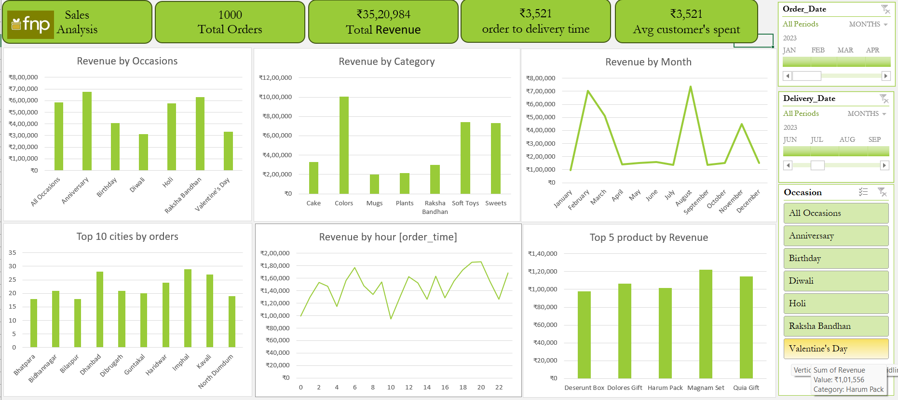

<h1>📊 FNP Sales Analysis Dashboard (MS Excel)</h1>

## 🎯 Project Objective
The FNP store aims to analyze sales performance for the selected period, helping the business identify:
- Top occasions generating the most revenue
- Best-selling categories and products
- High-performing cities
- Peak sales times  

This will help make **data-driven decisions** to boost revenue in future periods.

---

## 📂 Dataset Used
Sales transaction data containing:
- **Order Date & Delivery Date**
- **Occasion**
- **Product Category**
- **City**
- **Order Time**
- **Revenue**

---

## 📌 Key Questions (KPIs)
1. **Total Orders** and **Total Revenue** generated  
2. Occasion generating the highest revenue  
3. Best-performing category  
4. Month with highest revenue  
5. Top 10 cities contributing most to orders  
6. Peak sales hours  
7. Top 5 products by revenue  
8. Average customer spend  
9. Order-to-delivery performance  

---

## 🛠 Process
- ✅ Verified data for missing values & anomalies  
- ✅ Ensured consistent formatting (dates, categories, cities)  
- ✅ Created **Pivot Tables** for each KPI  
- ✅ Designed charts for:
  - Revenue by Occasion  
  - Revenue by Category  
  - Revenue by Month  
  - Top Cities by Orders  
  - Revenue by Hour  
  - Top Products by Revenue  
- ✅ Combined visuals into a single **interactive dashboard**  
- ✅ Applied slicers for dynamic filtering (Order Date, Delivery Date, Occasion)  

---

## 📊 Dashboard Insights
- **Total Orders:** 1,000  
- **Total Revenue:** ₹35,20,984  
- **Average Customer Spend:** ₹3,521  
- **Top Occasion:** Anniversary (~₹7 lakh)  
- **Top Category:** Colors (~₹10 lakh)  
- **Highest Revenue Months:** March & September (~₹7 lakh each)  
- **Top Cities:** Imphal, Dhanbad, Haridwar  
- **Peak Sales Hours:** 7 AM, 1 PM, 7 PM (~₹1.8–2 lakh)  
- **Top Product:** Magman Set (~₹1.3 lakh)  

---

## 📷 Dashboard Preview

---

## 🏆 Conclusion
This analysis provides a clear view of **sales patterns**, helping FNP focus on:
- High-performing occasions & categories  
- Promoting products in peak sales months  
- Targeting top cities for marketing  
- Optimizing delivery times  
